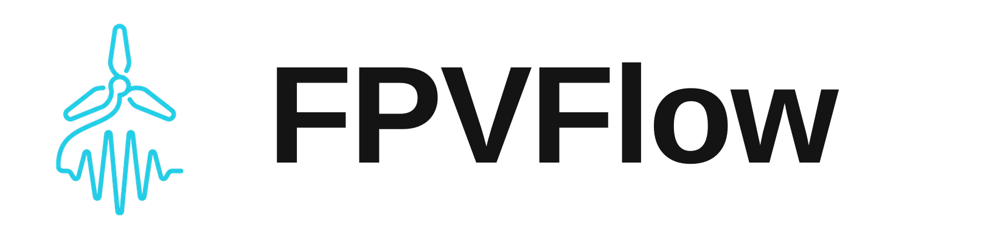
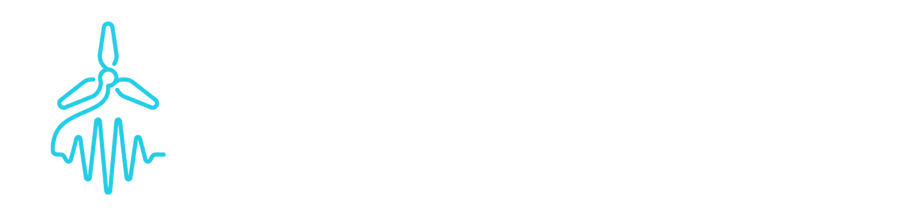

  <h1 align="center">
    
    
  </h1>

  

    Gyroflow melhorado para pilotos de FPV
     
    <em>Video stabilization using gyroscope data, with colour grading and external audio built in</em>
     
     
    <a href="https://github.com/rodrigosclosa/fpvflow/releases">Download</a> •
    <a href="https://github.com/rodrigosclosa/fpvflow/issues">Report bug</a> •
    <a href="https://github.com/rodrigosclosa/fpvflow/issues">Request feature</a> •
    <a href="https://docs.gyroflow.xyz">Gyroflow docs</a>
  

  

    
    
    
  

## About the project

**FPVFlow is a fork of [Gyroflow](https://github.com/gyroflow/gyroflow) 1.6.3**, with extra tools
aimed at FPV pilots. Everything Gyroflow does, it still does - this adds to it rather than
replacing it.

Gyroflow stabilizes video using motion data from a gyroscope and optionally an accelerometer.
Modern cameras record that data internally (GoPro, Sony, Insta360, DJI and others), and the
application uses it to stabilize the footage precisely. It can also read gyro data from an
external source, such as a Betaflight blackbox log.

FPVFlow starts its own version numbering at **1.0.0**. The upstream version it forked from
(1.6.3) stays visible in the app and in this README, because the lens profiles, the `.gyroflow`
project format and the [Gyroflow documentation](https://docs.gyroflow.xyz) all still apply.

> **This is not an official Gyroflow release.** Please do not report FPVFlow bugs to the Gyroflow
> project - open them [here](https://github.com/rodrigosclosa/fpvflow/issues) instead. All credit
> for the stabilization engine belongs to the Gyroflow authors.

  
  

## What FPVFlow adds

Two features that exist here and not upstream. Both were built for a specific problem: an FPV
pilot finishes a flight with log footage and a separately recorded audio track, and does not want
a second pass through an editor just to make the file usable.

### Colour grading with `.cube` LUTs

Cameras that record in a log profile (DJI D-Log M, GoPro Flat, and similar) need a conversion LUT
before the footage looks right. Doing that in an editor means rendering twice: once in Gyroflow
to stabilize, once more to grade.

FPVFlow applies the LUT **during stabilization**, so the exported file is already graded.

- **Load any Adobe Cube (`.cube`) file**, 1D or 3D, with trilinear interpolation. The parser
  reports the exact line when a file is malformed, which is what makes a truncated download
  recognizable as one.
- **Intensity slider** - blend the grade against the original from 0 to 100 %.
- **LUT library** - point it at a folder once and your LUTs are two clicks away instead of a file
  dialog every time. The folder is remembered between sessions.
- **13 colour adjustments**, applied after the LUT in Rec.709: exposure (in stops, computed in
  linear light), luminance, contrast, highlights, shadows, whites, blacks, temperature, tint,
  saturation, vibrance, sharpness and vignette.
- **Bit depth is preserved.** Everything runs in float and is quantized once, at the end, so
  10-bit footage stays 10-bit and gradients do not band.
- **The output is tagged Rec.709** when a LUT is loaded, so players show the converted file
  correctly instead of treating it as log.

The adjustments work with or without a LUT loaded - exposure, contrast and vignette are useful on
their own.

### External audio track

FPV setups often record sound separately: a DJI Mic on the pilot, or a naked GoPro with no
microphone at all. Lining that track up with the video is normally a manual job in an editor.

- **Import a separate audio file** (WAV, M4A, MP3, FLAC, AAC) and export it embedded in the
  stabilized video.
- **The source format is preserved** losslessly where the container allows it - a 32-bit float
  recording is not silently downgraded.
- **Auto-sync** correlates propeller vibration picked up by the microphone with the vibration the
  gyroscope recorded, and aligns the two. It is a convenience, not a requirement: the offset can
  always be set by hand.
- **Waveform on the timeline**, below the gyro chart, so the alignment is visible.

> **Known limitation:** the audio is embedded on export but is **not played back in the preview**.
> The preview player only demuxes an external track while reloading the media, which resets the
> trim and freezes playback - so that path was removed deliberately rather than shipped broken.

## Features inherited from Gyroflow

Everything below comes from Gyroflow 1.6.3 and works unchanged in FPVFlow.

- Real-time preview, parameter adjustments and all calculations
- GPU processing and rendering, all algorithms fully multi-threaded
- Rolling shutter correction
- [Video editor plugins](https://github.com/gyroflow/gyroflow-plugins) (Adobe Premiere/Ae, DaVinci Resolve, Final Cut Pro and more), allowing you to apply stabilization directly in a video editor without transcoding
- Supports full Sony metadata (recording params, automatic lens, support for IBIS, OIS, EIS - you can have IBIS enabled in camera and still apply Gyroflow on top)
- Supports already stabilized GoPro videos (captured with Hypersmooth enabled) (Hero 8 and up)
- Supports and renders 10-bit videos (up to 16-bit 4:4:4:4 for regular codecs and 32-bit float for OpenEXR - working directly on YUV data to maintain maximum quality)
- Customizable lens correction strength
- Render queue
- Keyframes
- Ability to create custom settings presets
- Visual chart with gyro data (displays gyro, accelerometer, magnetometer, and quaternions, including smoothed quaternions)
- Supports underwater footage (corrects underwater distortions)
- Modern responsive user interface with Dark and Light theme
- Adaptive zoom (dynamic cropping)
- Zoom limit
- Supports image sequences (PNG, OpenEXR, CinemaDNG)
- Based on [telemetry-parser](https://github.com/AdrianEddy/telemetry-parser) - supports all gyro sources out of the box
- Gyro low pass filter, arbitrary rotation (pitch, roll, yaw angles) and orientation
- Multiple gyro integration methods for orientation determination
- Multiple video orientation smoothing algorithms, including horizon levelling and per-axis smoothness adjustment.
- Cross-platform - works on Windows/Linux/Mac/Android/iOS
- Multiple UI languages
- Supports variable and high frame rate videos - all calculations are done on timestamps
- H.264/AVC, H.265/HEVC, ProRes, DNxHD, CineForm, PNG and OpenEXR outputs, with H.264 and H.265 fully GPU accelerated (ProRes also accelerated on Apple Silicon)
- Easy lens calibration process
- Fully zero-copy GPU preview rendering
- Core engine is a separate library without external dependencies (no Qt, no ffmpeg, no OpenCV), and can be used to create OpenFX and Adobe plugins (on the TODO list)
- Automatic updates of lens profile database
- Built-in official lens profiles for GoPro HERO 6-13; Sony; DJI; Insta360 action cameras; RunCam: Thumb series, 5 Orange
- Easy management of the video editor plugins from within the app
- Ability to add an additional 3D rotation (useful for framing vertical videos)

## Supported gyro sources
- [x] GoPro (HERO 5 and later)
- [x] Sony (a1, a7c, a7r V, a7 IV, a7s III, a9 II, a9 III, FX3, FX6, FX9, RX0 II, RX100 VII, ZV1, ZV-E10, ZV-E10 II, ZV-E1, a6700)
- [x] Insta360 (OneR, OneRS, SMO 4k, Go, GO2, GO3, GO3S, GOUltra, Caddx Peanut, Ace, Ace Pro)
- [x] DJI (Avata, Avata 2, O3/O4 Air Unit, Action 2/4/5/6/Nano, Neo, Neo2)
- [x] XTRA (Edge, Edge Pro)
- [x] Blackmagic RAW (*.braw)
- [x] RED RAW (V-Raptor, KOMODO) (*.r3d)
- [x] Canon (C50, C80, C400, R6 Mk3, R5 Mk2) (*.mp4, *.mov, *.mxf)
- [x] Freefly (Ember)
- [x] Betaflight blackbox (*.bfl, *.bbl, *.csv)
- [x] ArduPilot logs (*.bin, *.log)
- [x] Gyroflow [.gcsv log](https://docs.gyroflow.xyz/app/technical-details/gcsv-format)
- [x] iOS apps: [`Sensor Logger`](https://apps.apple.com/us/app/sensor-logger/id1531582925), [`G-Field Recorder`](https://apps.apple.com/at/app/g-field-recorder/id1154585693), [`Gyro`](https://apps.apple.com/us/app/gyro-record-device-motion-data/id1161532981)
- [x] Android apps: [`Sensor Logger`](https://play.google.com/store/apps/details?id=com.kelvin.sensorapp&hl=de_AT&gl=US), [`Sensor Record`](https://play.google.com/store/apps/details?id=de.martingolpashin.sensor_record), [`OpenCamera Sensors`](https://github.com/MobileRoboticsSkoltech/OpenCamera-Sensors), [`MotionCam Pro`](https://play.google.com/store/apps/details?id=com.motioncam.pro)
- [x] Runcam CSV (Runcam 5 Orange, iFlight GOCam GR, Runcam Thumb, Mobius Maxi 4K)
- [x] Hawkeye Firefly X Lite CSV
- [x] XTU (S2Pro, S3Pro)
- [x] WitMotion (WT901SDCL binary and *.txt)
- [x] Vuze (VuzeXR)
- [x] KanDao (Obisidian Pro, Qoocam EGO)
- [x] [CAMM format](https://developers.google.com/streetview/publish/camm-spec)

### Info for cameras not on the list

- For cameras which do have built-in gyro, please contact us and we will implement support for that camera. Refer to the [documentation](https://docs.gyroflow.xyz) for information about the gyro logging process.
- For cameras which don't have built-in gyro, you can use any other device which records gyro data. It may be a phone, an action camera, or an external device like a Betaflight FC, [flowshutter](https://github.com/gyroflow/flowshutter), [esp-gyrologger](https://github.com/VladimirP1/esp-gyrologger) (eg. on an [AtomS3](https://shop.m5stack.com/products/atoms3-dev-kit-w-0-85-inch-screen)). You just have to mount it on your main camera.

## Installation

FPVFlow is distributed only through the [Releases](https://github.com/rodrigosclosa/fpvflow/releases)
page and the build artifacts on the Actions tab. It is not in any app store.

### Windows
- Download `FPVFlow-windows64.zip`, extract it somewhere and run `FPVFlow.exe`
- If it shows an error about `VCRUNTIME140.dll` or `0xc0000142`, [install VC redist](https://aka.ms/vs/17/release/vc_redist.x64.exe)
- SmartScreen will warn on first run because the binary is unsigned - see below

### macOS
- Download the macOS artifact, unzip it and drag `FPVFlow.app` to Applications
- **First launch: right-click the app and choose Open**, then confirm. A plain double-click will
  be refused. macOS remembers the choice, so this is only needed once. See below for why.
- Universal binary: works on both Apple Silicon and Intel

### Linux
- Download `FPVFlow-linux64.AppImage`, make it executable (`chmod +x`) and run it
- Make sure you have latest graphics drivers installed
- Possibly needed packages: `sudo apt install libva2 libvdpau1 libasound2 libxkbcommon0 libpulse0 libc++-dev libvulkan1`
- GPU specific packages:
    - NVIDIA: `nvidia-opencl-icd nvidia-vaapi-driver nvidia-vdpau-driver nvidia-egl-icd nvidia-vulkan-icd libnvcuvid1 libnvidia-encode1`
    - Intel: `intel-media-va-driver i965-va-driver beignet-opencl-icd intel-opencl-icd`
    - AMD: `mesa-vdpau-drivers mesa-va-drivers mesa-opencl-icd libegl-mesa0 mesa-vulkan-drivers`

### Android and iOS
Not built by this fork. Use [Gyroflow](https://github.com/gyroflow/gyroflow) on mobile.

## About the unsigned builds

**The binaries are not code-signed, on any platform.** That is a cost decision, not an oversight,
and it is worth being upfront about what it means for you.

Code signing is not a single fee - it is a recurring one, per platform:

| Platform | What it costs | What you see without it |
|---|---|---|
| macOS | Apple Developer Program, **US$ 99/year** | Right-click → Open on first launch |
| Windows | Code signing certificate, **~US$ 200-400/year** | SmartScreen warning on first run |

For a free tool with no revenue, that is a real yearly bill for the removal of two one-time
clicks. So for now the builds ship unsigned, and this README tells you exactly what to expect
instead of leaving you to guess whether the warning means something is wrong.

**The build process is public.** Every release is built by [GitHub Actions](https://github.com/rodrigosclosa/fpvflow/actions)
from the commit it names, on GitHub's runners, with the workflow file visible in the repository.
You do not have to take the binary on trust - you can read exactly how it was produced, or build
it yourself from source with the instructions below.

**If donations ever cover it, the certificates get bought.** This is not a paid product and there
is no plan to make it one, but if there is enough support to carry the yearly cost, signing is the
first thing it goes to - starting with macOS, where the friction is worst. Until then, unsigned
and honest about it beats signed and quietly unsustainable.

The signing code is already in the build scripts, disabled for want of a certificate. Turning it
on is a matter of credentials, not work.

## Minimum system requirements:
- Windows 10 64-bit (1809 or later)
    - If you have Windows "N" install, go to `Settings` -> `Apps` -> `Optional features` -> `Add a feature` -> enable `Media Feature Pack`
- macOS 10.15 or later (both Intel and Apple Silicon are supported natively)
- Linux:
    - `.tar.gz` package (recommended): Debian 10+, Ubuntu 18.10+, CentOS 8.2+, openSUSE 15.3+. Other distros require glibc 2.28+ (`ldd --version` to check)
    - `.AppImage` should work everywhere
- Android 6+
- iOS 14+

## Help and support

**For FPVFlow** - the colour panel, the external audio track, or anything else specific to this
fork - open an issue [here](https://github.com/rodrigosclosa/fpvflow/issues).

**Please do not take FPVFlow problems to the Gyroflow project.** Their Discord and issue tracker
are for the official application, and its maintainers did not build this fork and cannot support
it. If you are unsure which one you are using, check the version in the app: FPVFlow shows
"v1.0.0 · baseado no Gyroflow 1.6.3".

For questions about stabilization itself - lens profiles, gyro sources, synchronization - the
[Gyroflow documentation](https://docs.gyroflow.xyz) applies unchanged and is excellent.

## Supporting the project

FPVFlow is free and GPL-3.0, and there is no paid version planned. If you want to help it along,
the most useful things are free: report bugs with a sample clip, and tell other pilots it exists.

Financial support, if it ever arrives, goes to the code signing certificates described above -
macOS first. Nothing else about the application changes either way.

If you value the stabilization engine underneath, consider
[supporting Gyroflow](https://github.com/sponsors/AdrianEddy) as well. That is where the hard part
was built.

## Test data
You can download some clips with gyro data from here: https://drive.google.com/drive/folders/1sbZiLN5-sv_sGul1E_DUOluB5OMHfySh?usp=sharing

## Roadmap

See the [open issues](https://github.com/gyroflow/gyroflow/issues) for a list of proposed features and known issues.
There's also a ton of TODO comments throughout the code.

### Video editor plugins
Gyroflow OpenFX plugin is available [here](https://github.com/gyroflow/gyroflow-plugins). OpenFX plugin was tested in DaVinci Resolve

Adobe Premiere and After Effects plugin is available [here](https://github.com/gyroflow/gyroflow-plugins)

Final Cut Pro plugin is available as [Gyroflow Toolbox](https://gyroflowtoolbox.io).

## Contributing

Contributions are what make the open source community such an amazing place to learn, inspire, and create. Any contributors are **greatly appreciated**.
* If you have suggestions for adding or removing features, feel free to [open an issue](https://github.com/gyroflow/gyroflow/issues/new) to discuss it.
* If you want to implement a feature, you can fork this project, implement your code and open a pull request.

### Translations
Currently *Gyroflow* is available in:
* **English** (base language)
* **Chinese Simplified** (by [DusKing1](https://github.com/DusKing1))
* **Chinese Traditional** (by [DusKing1](https://github.com/DusKing1))
* **Czech** (by Jakub Ešpandr, VitroidFPV, davidazarian, Michael Kmoch)
* **Danish** (by [ElvinC](https://github.com/ElvinC))
* **Finnish** (by Jesse Julkunen)
* **French** (by KennyDorion)
* **Galician** (by Martín Costas)
* **German** (by [Grommi](https://github.com/Gro2mi) and [Nicecrash](https://github.com/B-nutze-RR))
* **Greek** (by [Stamatis Galiatsatos](https://github.com/Logicenios))
* **Indonesian** (by Aloysius Puspandono)
* **Italian** (by Rosario Casciello)
* **Japanese** (by 井上康)
* **Korean** (by EP45)
* **Norwegian** (by [MiniGod](https://github.com/MiniGod) and [alexagv](https://github.com/alexagv))
* **Polish** (by [AdrianEddy](https://github.com/AdrianEddy))
* **Portuguese Brazilian** (by KallelGaNewk)
* **Portuguese** (by Ricardo Pimentel)
* **Russian** (by Андрей Гурьянов, redstar01 and lukdut)
* **Slovak** (by Radovan Leitman and Eduard Petrovsky)
* **Spanish** (by Pelado-Mat)
* **Turkish** (by [Metin Oktay Yılmaz](https://github.com/mettinoktay))
* **Ukrainian** (by Artem Alexandrov)

*Gyroflow*'s own translations are managed upstream on crowdin: https://crowdin.com/project/gyroflow

Strings added by this fork (the colour panel and the external audio panel) are not in that
project - contributing them there would not reach FPVFlow. Open an issue here instead if you
want to translate them.

#### I want to contribute but I don't know Rust or QML
* The Rust book is a great way to get started with Rust: https://doc.rust-lang.org/book/
* Additional useful resources for Rust: https://quickref.me/rust and https://cheats.rs/
* For the UI stuff, there's a nice QML book by The Qt Company: https://www.qt.io/product/qt6/qml-book

## Development
### Used languages and technologies
*Gyroflow* is written in [Rust](https://www.rust-lang.org/), with UI written in [QML](https://doc.qt.io/qt-6/qmlfirststeps.html). It uses *Qt*, *ffmpeg*, *OpenCV* and *mdk-sdk* external dependencies for the main program, but the core library is written in pure Rust without any external dependencies.

OpenCV usage is kept to a minimum, used only for lens calibration and optical flow (`src/core/calibration/mod.rs` and `src/core/synchronization/opencv.rs`). Core algorithms and undistortion don't use OpenCV.

GPU stuff supports *DirectX*, *OpenGL*, *Metal* and *Vulkan* thanks to *Qt RHI* and *wgpu*.
For GPU processing we use *OpenCL* or *wgpu*, with highly parallelized CPU implementation as a fallback.

The FPVFlow binary links against mdk-sdk, which is closed-source and not licensed under the GNU GPL.
FPVFlow, like Gyroflow, is licensed under GPLv3 with an additional permission allowing linking with mdk-sdk. mdk-sdk is distributed under its own license.

### Code structure
1. Entire GUI is in the `src/ui` directory
2. `src/controller.rs` is a bridge between UI and core, it takes all commands from QML and calls functions in core
3. `src/core` contains the whole gyroflow engine and doesn't depend on *Qt* or *ffmpeg*. *OpenCV* is optional
4. `src/rendering` contains all FFmpeg related code for rendering final video and processing for synchronization
5. `src/core/gpu` contains GPU implementations of the undistortion
6. `src/qt_gpu` contains zero-copy GPU undistortion path, using Qt RHI and GLSL compute shader
7. `src/gyroflow.rs` is the main entry point
8. `mod.rs` or `lib.rs` in each directory act as a main entry of the module (directory name is the module name and `mod.rs` is kind of an entry point)

### Dev environment
`Visual Studio Code` with `rust-analyzer` extension.

For working with QML I recommend to use Qt Creator and load all QML files there, as it has auto-complete and syntax highlighting.
The project also supports UI live reload, it's a super quick way of working with the UI. Just change `live_reload = true` in `gyroflow.rs` and it should work right away. Now every time you change any QML file, the app should reload it immediately.

### Building on Windows
0. Prerequisites: `git`, `7z` and working `powershell`. If you never ran powershell scripts before, run `set-executionpolicy remotesigned` in powershell as admin
1. Get latest stable Rust language from: https://rustup.rs/
    - Please make sure to check the English language pack option when installing the C++ build tools from Visual Studio Installer
2. Install `Just` by running `cargo install --force just`
3. Clone the repo: `git clone https://github.com/rodrigosclosa/fpvflow.git`
4. Enter the project directory and:
    - Install dependencies: `just install-deps`
    - Compile and run: `just run`

### Building on MacOS
0. Prerequisites: `git`, `brew`
1. Get latest stable Rust language from: https://rustup.rs/
2. Install `Just` by running `cargo install --force just`
3. Clone the repo: `git clone https://github.com/rodrigosclosa/fpvflow.git`
4. Enter the project directory and:
    - Install dependencies: `just install-deps`
    - Compile and run: `just run`
    - The first time you run it won't work, run `just deploy` once and then `just run` will work

### Building on Linux
0. Prerequisites: `git`, `7z`, `python`, `apt` package manager (or adjust commands inside scripts if on different distro)
1. Get latest stable Rust language from: https://rustup.rs/
2. Install `Just` by running `cargo install --force just`
3. Clone the repo: `git clone https://github.com/rodrigosclosa/fpvflow.git`
4. Enter the project directory and:
    - Install dependencies: `just install-deps`
    - Compile and run: `just run`

### Building for Android
0. Prerequisites: `git`, `7z`, working `powershell`, Android SDK and NDK. Building is supported only on Windows
1. Get latest stable Rust language from: https://rustup.rs/
2. Install `Just` by running `cargo install --force just`
3. Clone the repo: `git clone https://github.com/rodrigosclosa/fpvflow.git`
4. Install Android SDK and NDK r23c and update paths in `_scripts/android.just`
5. Enter the project directory and:
    - Install dependencies: `just android install-deps`
    - Compile the apk and install on device: `just android deploy`

### Building for iOS
0. Prerequisites: `git`, `brew`
1. Get latest stable Rust language from: https://rustup.rs/
2. Install `Just` by running `cargo install --force just`
3. Clone the repo: `git clone https://github.com/rodrigosclosa/fpvflow.git`
4. Enter the project directory and:
    - Install dependencies: `just ios install-deps`
    - Update Team ID, signing keys and provisioning profiles in `_scripts/ios.just`
    - Compile and run on device: `just ios run`

### Profiling on Windows
1. Install and run `Visual Studio Community Edition`
2. Compile and run Gyroflow with the `profile` profile: `just profile`
3. In Visual Studio, go to `Debug -> Performance Profiler...`
    - Under `Target`, open `Change Target` and select `Running Process...`, select the running `gyroflow.exe` process

### Profiling QML
1. Uncomment `config.define("QT_QML_DEBUG", None);` in `build.rs`
2. Comment `cli::run()` in `gyroflow.rs`
3. Run in debug mode with QML debugger args: `cargo run -- "-qmljsdebugger=port:1234,block,services:CanvasFrameRate,EngineControl,DebugMessages"`
4. In Qt Creator go to `Analyze` -> `QML Profiler (Attach to Waiting Application)` and enter port 1234

## License

Distributed under the GPLv3 License with App Store Exception. See [LICENSE](https://github.com/rodrigosclosa/fpvflow/blob/fpvflow/LICENSE) for more information.

The stabilization engine, the lens profile database and the vast majority of this codebase are
the work of the Gyroflow authors. FPVFlow adds to it under the same licence.

As additional permission under section 7, you are allowed to distribute [`gyroflow_core`](https://github.com/gyroflow/gyroflow/tree/master/src/core) through an app store, even if that store has restrictive terms and conditions that are incompatible with the GPL, provided that the source is also available under the GPL with or without this permission through a channel without those restrictive terms and conditions.

The Gyroflow binary links against mdk-sdk, which is closed-source and not licensed under the GNU GPL.
An additional permission is granted allowing linking with mdk-sdk. mdk-sdk is distributed under its own license.

## Authors

* [AdrianEddy](https://github.com/AdrianEddy/) - *Author of the Rust implementation (code in this repository), author of the UI, GPU processing, rolling shutter correction, advanced rendering features and the Adobe plugin*
* [Elvin Chen](https://github.com/ElvinC/) - *Author of the first version in Python, laid the groundwork to make all this possible*

### Notable contributors
* [Maik Menz](https://github.com/mycosd/) - *Contributed to all areas of Gyroflow with fixes and improvements*
* [Aphobius](https://github.com/Aphobius/) - *Author of the velocity dampened smoothing algorithm*
* [Marc Roeschlin](https://github.com/marcroe/) - *Author of the adaptive zoom algorithm*
* [Ilya Epifanov](https://github.com/ilya-epifanov/) - *Author of the OpenFX plugin*
* [Vladimir Pinchuk](https://github.com/VladimirP1/) - *Author of robust gyro-to-video synchronization algorithm and Sony lens/IBIS data*
* [Chris Hocking](https://github.com/latenitefilms) - *Author of the [Gyroflow Toolbox](https://gyroflowtoolbox.io) Final Cut Pro Plugin*

## Acknowledgements

* [Gyroflow Python version (legacy code)](https://github.com/ElvinC/gyroflow)
* [telemetry-parser](https://github.com/AdrianEddy/telemetry-parser)
